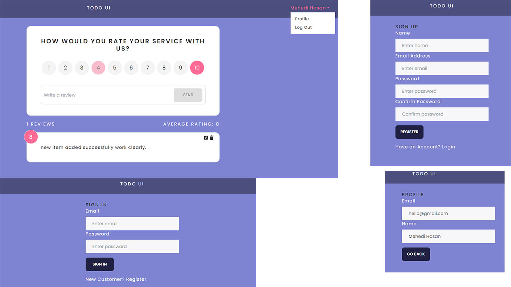

# Todo APP

> Todo  platform built with the SERN (Mysql,Express,React,Ndejs) stack & Redux.

<!--  -->


## Features

- Full featured Todo UI
- LogIn & Logout
- User Profile where user can see their name and email
- Give Rating
- Create Form with rating
- See all Forms
- Edit & Delete Forms
- User Average rating & total Reviews


## Mysql Setup

```
CREATE DATABASE todo

CREATE TABLE `todo`.`store` (
  `id` INT  UNSIGNED NOT NULL  AUTO_INCREMENT,
  `title` MEDIUMTEXT NOT NULL,
  `rating` FLOAT NOT NULL,
  `userId` INT NOT NULL,
  PRIMARY KEY (`id`));

CREATE TABLE `todo`.`users` (
  `_id` INT UNSIGNED NOT NULL AUTO_INCREMENT,
  `name` VARCHAR(255) NOT NULL,
  `email` VARCHAR(255) NOT NULL,
  `password` VARCHAR(255) NOT NULL,
  PRIMARY KEY (`_id`));

```
### Important for mysql setup

After set up this thing go to backend folder 
then go to util folder datbase.js file then go to the 
6th line which is `(user: 'root')` set user name your own mysql workbench username for my case my username is root.


### Env Variables

Create a `.env` file in the root folder which is todo and set this thing.

```
PORT = 5000
SECRET_KEY = 'abc123' (jwt secret key)
SQ=your mysql password set here

Change the SECRET_KEY  to what you want
For SQ your type your own mysql password

```


### Install Dependencies (frontend & backend)

```
npm install
cd frontend
npm install
```

### Run

```

# Run frontend (:3000) & backend (:5000)
npm run dev

# Run backend only
npm run server
```


